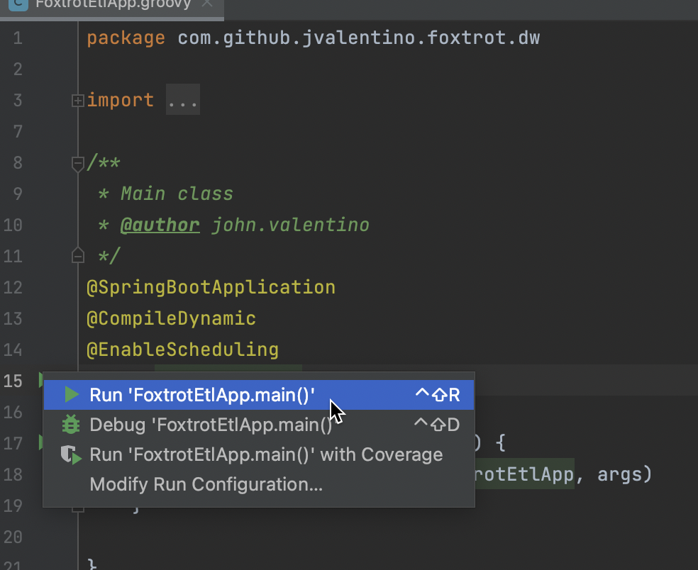
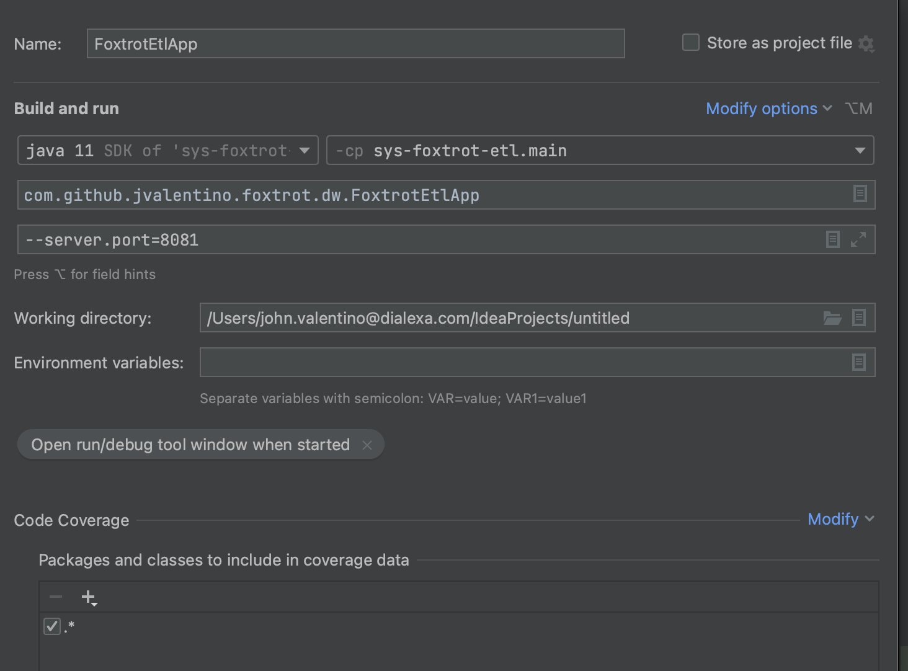
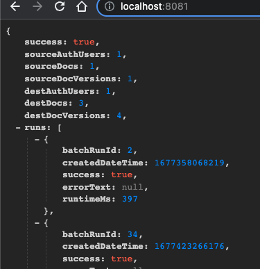

# System Foxtrot ETL

This application serves the function of taking data from the main database and using it to populate a database used for data warehousing as a part of the overall https://github.com/jvalentino/sys-golf project. For system details, please see that location.

Prerequisites

- Java
- IntelliJ
- Docker
- Docker Compose
- pgadmin
- Git
- Helm
- Minikube

All of these you can get in one command using this installation automation (if you are on a Mac): https://github.com/jvalentino/setup-automation

## Database

You launch the database container by running:

```
docker compose up -d
```

This sill execute the container in detached mode, and leave it running in the background.

However, this only runs the warehousing database, so you also need to go into the sys-foxtrot-rest project and run its database too:

```bash
docker compose up -d
```


## IDE Testing

This imports as a standard Gradle project, in which you are able to easily execute tests:

[](https://github.com/jvalentino/sys-alpha-bravo/blob/main/wiki/testing.png)

## Runtime

You can right-click on the main application and run as a Spring Boot App, however I am also running it on port 8081 so I can run the rest app at the same time:





This will then be accessible via http://localhost:8081, which gives a status page:



## Verification

[](https://github.com/jvalentino/sys-alpha-bravo/blob/main/wiki/ide_check.png)

Running check will execute both testing and static code analysis via the build.

This is otherwise the same as doing this at the command-line: `./gradlew check`

## Strategy

Codenarc is used to ensure that no common coding issues can be added.

Jacoco is used to enforce that line coverage is over 85%.

Tests that end in "IntgTest" are used for integration testing via Spring Boot Test, otherwise they are unit tests.

Every code commit triggers a Github Action pipeline that runs the entire build process.

## Build

The following builds the executable jar file:

```bash
./gradlew build
```

...and then the following builds and publishing locally the docker image:

```bash
./build-docker.sh
```

# Dev

## Prometheus

Getting Prometheus to work required the following steps:

### build.gradle

```groovy
// monitoring
	implementation 'org.springframework.boot:spring-boot-starter-actuator'
	implementation 'io.micrometer:micrometer-registry-prometheus'
```

### application.properties

```properties
management.endpoints.web.exposure.include=health, metrics, prometheus
```

### SpringWebConfig

```groovy
@Override
    void configureMessageConverters(List<HttpMessageConverter<?>> converters) {
        converters.add(new MappingJackson2HttpMessageConverter(jsonMapper()))

        // requires for prometheus endpoint
        StringHttpMessageConverter converter = new StringHttpMessageConverter()
        converter.setSupportedMediaTypes(Arrays.asList(
                MediaType.TEXT_PLAIN,
                new MediaType('application', 'openmetrics-text')))
        converters.add(converter)

        // No converter for [class java.lang.String] with preset Content-Type
        // 'application/openmetrics-text;version=1.0.0;charset=utf-8']
    }
```

### WebSecurityConfig

```groovy
@Override
    protected void configure(HttpSecurity http) throws Exception {
        // https://stackoverflow.com/questions/32064000/uploading-file-returns-403-error-spring-mvc
        http.cors().and().csrf().disable()

        http
                .authorizeRequests()
                .antMatchers(
                        '/resources/**',
                        '/webjars/**',
                        '/',
                        '/custom-login',
                        '/invalid',
                        '/actuator/prometheus',
                        '/actuator/health'
                ).permitAll()
                .anyRequest().authenticated()
    }
```

## Docker

### build-docker.sh

You build the docker image by running this:

```bash
./build-docker.sh
```

This script consists of the following:

```bash
#!/bin/bash

NAME=sys-golf-etl
VERSION=latest
HELM_NAME=etl

helm delete $HELM_NAME || true
minikube image rm $NAME:$VERSION
rm -rf ~/.minikube/cache/images/arm64/$NAME_$VERSION || true
docker build --no-cache . -t $NAME
minikube image load $NAME:$VERSION
```

There is quite a bit of magic in here not directly relating to docker. This scripting ensures we build a clean new image, make sure to remove it if it is running in Minikube, and then load it back into the cache.

### Dockerfile

The container for running this application consists of two parts:

- Openjdk - For running the application
- Fluentbit - A log forwarder to take the log files from nginx and forward them to Elasticsearch.

```docker
FROM openjdk:11
WORKDIR .
COPY build/libs/sys-golf-etl-0.0.1.jar /usr/local/sys-golf-etl-0.0.1.jar
EXPOSE 8080
COPY config/docker/start.sh /usr/local/start.sh

# puts it in /opt/fluent-bit/bin/fluentbit
RUN curl https://raw.githubusercontent.com/fluent/fluent-bit/master/install.sh | sh
COPY config/docker/fluentbit.conf /opt/fluent-bit/bin/fluentbit.conf

RUN ["chmod", "+x", "/usr/local/start.sh"]
ENTRYPOINT ["/usr/local/start.sh"]
```

### fluentbit.conf

```properties
[INPUT]
    name              tail
    path              /usr/local/*.log
    multiline.parser docker, cri

[OUTPUT]
    Name  es
    Match *
    Host elasticsearch-master
    Port 9200
    Index etl
    Suppress_Type_Name On
```

This configuration picks up the custom log files, and forward them to elastic search using the index of `etl`.

### start.sh

We already have a custom script for our entry point, where we now change it to also run fluent bit in the background:

```bash
#!/bin/bash
cd /opt/fluent-bit/bin
./fluent-bit -c fluentbit.conf > fluentbit.log 2>&1 &

cd /usr/local
java -jar \
  -Dspring.datasource-primary.url=jdbc:postgresql://pg-secondary-postgresql:5432/dw \
  -Dspring.datasource-secondary.url=jdbc:postgresql://pg-primary-postgresql:5432/examplesys \
  sys-golf-etl-0.0.1.jar
```

